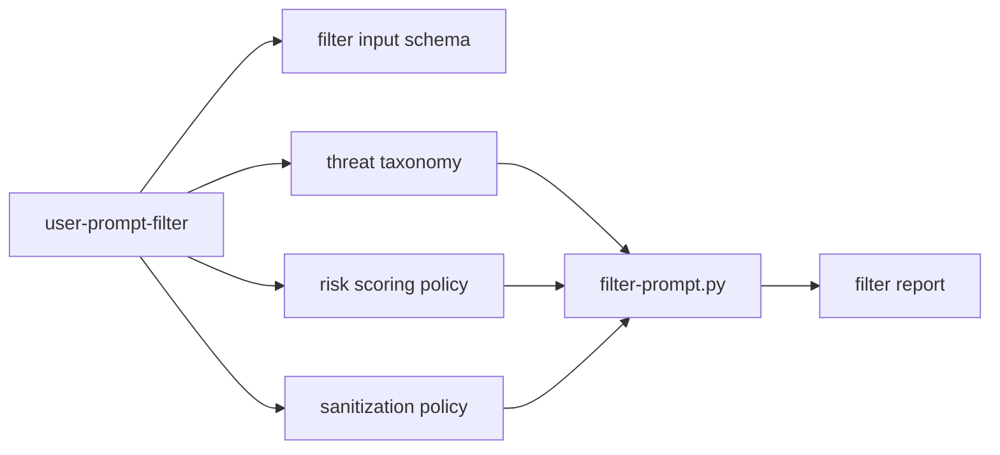

# User Prompt Filter Knowledge Graph

```mermaid
flowchart LR
  Skill["user-prompt-filter"] --> Input["filter input schema"]
  Skill --> Taxonomy["threat taxonomy"]
  Skill --> Scoring["risk scoring policy"]
  Skill --> Sanitize["sanitization policy"]
  Taxonomy --> Script["filter-prompt.py"]
  Scoring --> Script
  Sanitize --> Script
  Script --> Report["filter report"]
```
